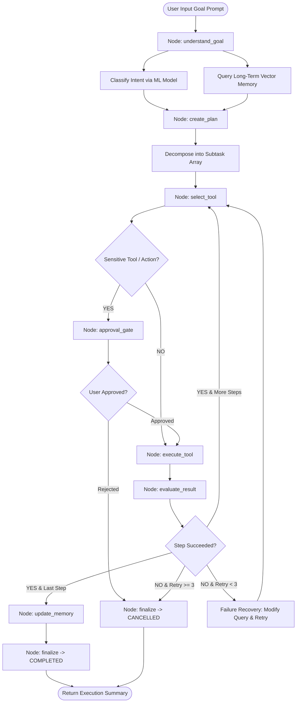
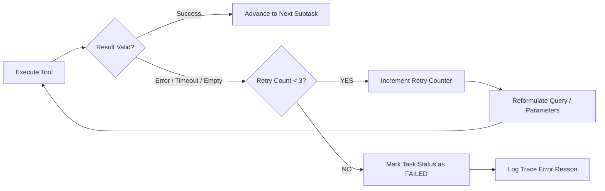
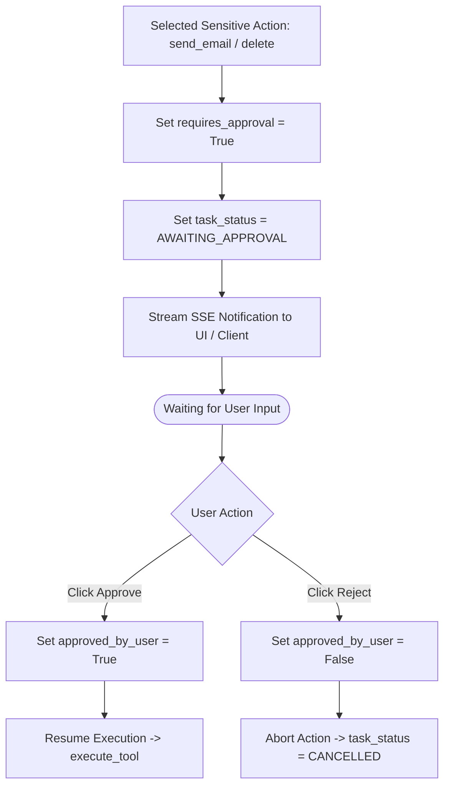

# Agent Execution Flowcharts & Decision Logic

## 1. High-Level Agent Execution Pipeline

```mermaid
flowchart TD
    Start([User Input Goal Prompt]) --> UnderstandGoal[Node: understand_goal]
    UnderstandGoal --> MLClassify[Classify Intent via ML Model]
    UnderstandGoal --> MemoryFetch[Query Long-Term Vector Memory]
    MLClassify --> CreatePlan[Node: create_plan]
    MemoryFetch --> CreatePlan
    
    CreatePlan --> PlanDecomp[Decompose into Subtask Array]
    PlanDecomp --> SelectTool[Node: select_tool]
    
    SelectTool --> CheckApproval{Sensitive Tool / Action?}
    CheckApproval -->|YES| ApprovalGate[Node: approval_gate]
    CheckApproval -->|NO| ExecTool[Node: execute_tool]
    
    ApprovalGate --> PauseState{User Approved?}
    PauseState -->|Approved| ExecTool
    PauseState -->|Rejected| FinalizeFail[Node: finalize -> CANCELLED]
    
    ExecTool --> EvalResult[Node: evaluate_result]
    EvalResult --> SuccessCheck{Step Succeeded?}
    
    SuccessCheck -->|YES & More Steps| SelectTool
    SuccessCheck -->|YES & Last Step| UpdateMem[Node: update_memory]
    SuccessCheck -->|NO & Retry < 3| Replan[Failure Recovery: Modify Query & Retry]
    Replan --> SelectTool
    SuccessCheck -->|NO & Retry >= 3| FinalizeFail
    
    UpdateMem --> FinalizeSuccess[Node: finalize -> COMPLETED]
    FinalizeSuccess --> Stop([Return Execution Summary])
    FinalizeFail --> Stop
```

---

## 2. Failure Recovery & Retry Loop Flowchart

```mermaid
flowchart LR
    ToolExec[Execute Tool] --> ResultCheck{Result Valid?}
    ResultCheck -->|Success| NextStep[Advance to Next Subtask]
    ResultCheck -->|Error / Timeout / Empty| RetryCount{Retry Count < 3?}
    
    RetryCount -->|YES| Increment[Increment Retry Counter]
    Increment --> Reformulate[Reformulate Query / Parameters]
    Reformulate --> ToolExec
    
    RetryCount -->|NO| FailState[Mark Task Status as FAILED]
    FailState --> LogError[Log Trace Error Reason]
```

---

## 3. Human Approval Gate Flowchart

```mermaid
flowchart TD
    SelectSensitiveTool[Selected Sensitive Action: send_email / delete] --> SetFlag[Set requires_approval = True]
    SetFlag --> PauseWorkflow[Set task_status = AWAITING_APPROVAL]
    PauseWorkflow --> NotifyUI[Stream SSE Notification to UI / Client]
    NotifyUI --> AwaitInput([Waiting for User Input])
    
    AwaitInput --> UserChoice{User Action}
    UserChoice -->|Click Approve| GrantPass[Set approved_by_user = True]
    UserChoice -->|Click Reject| GrantDeny[Set approved_by_user = False]
    
    GrantPass --> ResumeExec[Resume Execution -> execute_tool]
    GrantDeny --> AbortExec[Abort Action -> task_status = CANCELLED]
```
